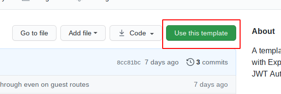
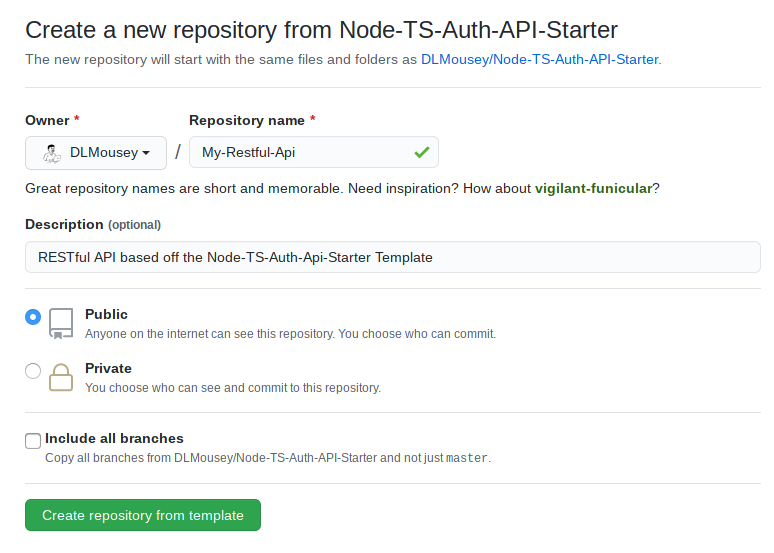

This repo contains a fully functional example RESTful API using NodeJS, Typescript, ExpressJS and TypeORM.
The getting started guide on this page is split into 2 secions - creating your own API based off this template (New API), 
and setting up and environment to work on the template itself (Template Dev).

# Developer Setup (New API)

- Click the "Use this template" button on the homepage for this repo;


- This will take you to a create repo page like so;


- Follow the steps to create your repository

- Clone the new repo onto your machine;
```shell script
git clone https://github.com/your-username/your-repo-name
```

- Open the project directory
```shell script
cd your-repo-name
```

- Install the dependencies
```shell script
npm install
```

- Create the environment file
```shell script
cp .env.sample .env
```

- Open the new `.env` file you created and adjust the settings to match your development environment

- Start the development server
```shell script
npm start
```

You're now ready to start building your api, a good place to start would be adding [a new router](routers.md)

